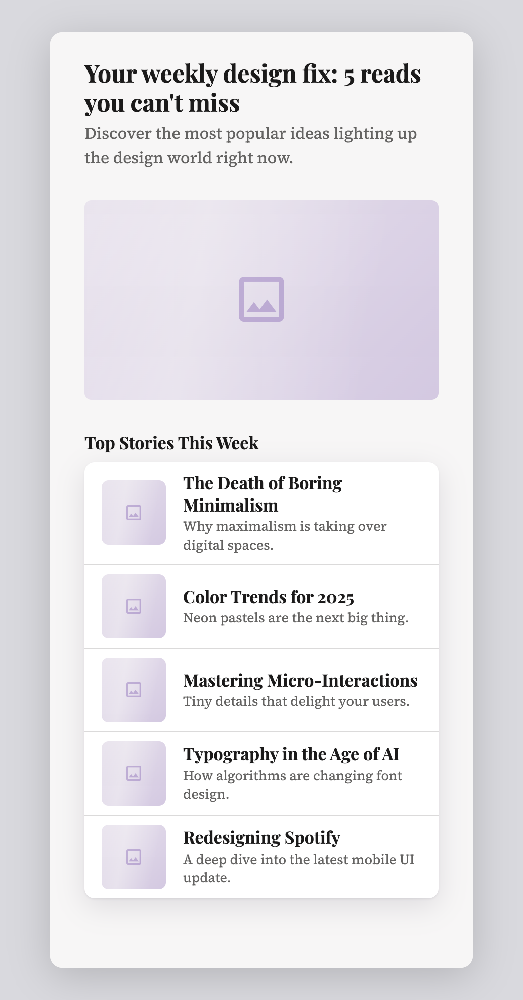

# The graph, written down

A DESIGN.md made paint portable: anyone can bring their own. What decides the *structure* of an apparition
(which questions Jev is asked, how they nest, what code does with the answers) is tables and rules in
`src/server/mock/plan.ts`. Nobody can bring their own of that. This note is about whether they could: a
terse file that holds a decision graph, that anyone can read, and that a reader which knows nothing about
screens can run.

It is a probe, side by side with the code it was taken from. Nothing the tool serves reads these files yet.

```sh
npm run grammar:export                                  # writes grammar/*.md from the code
npm run probe:grammar                                   # grammar/screen.md on its own examples, live, and against readPlan
npm run probe:grammar -- grammar/examples/email.md      # any graph
npm run probe:draw -- grammar/examples/email.md "Weekly digest of the five most-read design articles"   # any graph, drawn
node --import tsx --test src/server/grammar/*.test.ts
```

There are two kinds of file. A **graph** (`screen.md`, `paint.md`, `examples/email.md`) is somebody's decisions:
what is asked, how the answers are read, what each part is made of. A **catalog** (`kit.md`) is what a renderer
can draw. A graph names the catalog's patterns; neither contains the other.

## The format

Markdown, because what Jev reads is prose, and the criteria of a question are most of a graph. Each of
Jev's three primitives is a kind of markdown list, and a blockquote is what is asked:

```markdown
### list
> Does the screen show several similar items?

+ Results, products, people, records, line items.          a Noul: `+` and `-` are both bullets in markdown
- The screen is about one thing, or only about settings.

#### custom_size
> If the screen has something drawn specially for it, how much room does that thing need?

- **strip** `3:1` — A thin band across the screen.         a Choice: bullets that open with a bold name;
- **tall** `3:4` — Most of the height of the screen.       the code after the name is what the option yields

## vivid → accent chroma
> How vivid should this product's accent color be?

1. `0.04` Almost grey: dusty, muted, restrained.           a Score: a numbered rubric. A value at every level
5. `0.3` Neon: as vivid as a screen can show.              makes it a dial: 2.7 of 4 falls between two values
```

**Headings nest the way decisions do.** A question under a heading is read only when the heading's answer
is yes; otherwise it has its default (no; or `none`; or else the first option). The heading is the id the
answer comes back under.

**A Choice whose options carry a shape is the kind of thing being made.** The shape is one line: the parts
this kind may have, in the order they come. CAPITALS are always there, a bare name is expected, a `?` is an
extra. That line is all of `order`, `requires`, `expects` and `atLeast`:

```markdown
- **checkout** — Review and commit: a cart, an order summary with totals, payment.
  `banner? custom? list facts form? actions?` at least 2, sticky actions
```

The headings under that Choice are the parts, and a part's question is answered under `has_<part>`. Words
after the shape that are not `at least N` are traits: told to whoever draws the thing, not read by the graph.

**There are no thresholds in the file.** "Expected" and "extra" are tiers; how sure an answer must be for
each is a fact about whoever answers, kept beside the reader (`JEV` in `read.ts`: 0.4, 0.75, and 0.5 for any
other yes; one question probed on its own, `has_custom` at 0.55). gev says 0.00 where Jev says 0.82, so a
number written into a graph would be wrong the moment somebody switched.

**What nesting and tiers cannot say is a rule**, in one flat form, applied in the order written, with its
reason, which is what the person reads in the trace when the rule overrules Jev:

```markdown
## Rules
- when form, no actions — a form's submit button is the screen's call to action
- when archetype is checkout and no form, actions — with no form to submit, it needs a button to commit with
- when item_leading is not thumbnail, list_layout is rows — picture layouts are for things with a look
```

A condition is a part (`list`, `no list`) or an answer (`x is y`, `x is not y`), joined by `and`. There is
no else, no or, no nesting.

**A set of options can live in another file**, and a markdown link is the import:
`among [icons](icons.md)`. A set is a file with options under its title and nothing asked. Names with no
criteria are written as a run of code spans, so 185 symbols are 23 lines.

**A graph carries its own probe.** Examples are things the graph was written to read, each with how it
should come out, in the words rules use. An example with no claim is still something to run.

```markdown
## Examples
- Your one-time sign-in code → kind is verify, code, no hero, no items
- Find a dog walker: nearby walkers with ratings
```

What is read is `{ <name of the graph>: <the example> }`, or `## Examples (key)` names the key.

**A part says what it is made of, once**, and that is two things at the same time: what a writer is asked
for, and where each piece goes in whatever draws the part.

```markdown
### list → collection                                     drawn by the catalog's `collection`

- `heading` as heading, when archetype is not feed — Heading above the list.
- `items` 3–8, as items — The items.                      a list of three to eight
  - `title` as headline — The item's name.                written, and bound to the pattern's `headline` slot
  - `price` as meta, when item_price is yes — Price…      there only when that answer is yes
  - `on` boolean, as on, when item_trailing is switch or checkbox — Whether it is on.
  - `tone` as tone, decided                               bound, but not written: Jev decides it once the words exist
  - `imageUrl` as picture, found                          nor this: it is looked for in the photo library

#### list_layout → layout                                 the answer turns the pattern's `layout` knob
#### custom_size → ratio                                  …as what it yields: `tall` turns `ratio` to `3:4`
```

A field line is a name in code, then what is said about it (a type, how many, `as` a slot, `optional`, where it
comes from if nobody writes it, `when` it is there), then a dash and what the writer is told. Under a field:
what each element is made of, or `- each — One or two words.` when each is a single value, or
`- when facts_total is yes — The last one is the total.`, which is one more thing to tell the writer, sometimes.
A part that is nothing but a list gives the list its own name (`facts` is 2–8 rows). A heading with fields and
no question is always there (`## header`). A yes or a no can yield a name, for turning a knob that takes one:
`+ \`thumbnail\` Products, articles with a lead image.`

**A catalog is a file of patterns**: what each is for (the sentence a Choice would offer), its slots, written as
fields are, and its knobs with what they can be set to. `grammar/kit.md` is written out from `patterns.ts`.
`checkBindings(graph, catalog)` needs only the two files: a part drawn by a pattern the catalog lacks, a field
sent to a slot that is not there, a required slot nothing fills, an answer that can yield what a knob cannot
take; and a warning for a part that names no pattern, which nothing will draw.

`checkGrammar` is the start of a lint. Errors: a part nothing describes, a rule or example naming what is
not asked, a Choice with one option. Warnings are this project's scars: a yes-or-no question that does not
say what yes and no look like (they come back near even odds), a question under a part that does not open
with "If…" (it is asked before anyone knows the part is there), a graph with no examples.

## What was tried, and what came of it

**Step 0: write the tool's own graphs out, and read them back.** `grammar/screen.md` (34 questions, 9 kinds
of screen, 12 parts, 8 rules, 30 examples) and `grammar/paint.md` (12 questions, 5 of them Scores) are
written by `export.ts` from what is actually asked (`planQuestions()`, `mixQuestions()`), not from the
tables behind them. The tests hold that:

- the files are what the code asks today, and a file read and written again is the same file;
- read from the file, the request to Jev is deep-equal to `planQuestions()`, and to `mixQuestions()`;
- `readGrammar`, which knows nothing about screens, followed by `planOf`, which only renames fields, makes
  the `ScreenPlan` that `readPlan` makes: 3000 random sets of answers, some near certain and some torn,
  with and without kinds ruled out, parts settled by the developer, and `topLevel` settled by how the
  person arrived;
- nothing in the file is decoration: take out any one rule, the `never padding` trait, or the probed
  threshold, and some screen comes out differently;
- a Score with values reads as `design-mix.ts` reads its dials.

Live (`npm run probe:grammar`, 2026-09-21, jev-latest): asked from the file, **30 of 30 plans are the plan
`readPlan` makes of the same answers**; 26 of 28 labelled examples came out as labelled.

One of the two misses is a find. "Thermostat control for the living room": Jev says custom at 0.56, which
clears the probed threshold, and `probe:custom` counts that a pass. But Jev also reads the screen
as `settings`, and a settings screen has no custom part, so nothing is baked. An example that claims a
*reading* catches what a probe of one raw answer cannot.

**Step 1: a graph nobody wrote code for.** `grammar/examples/email.md`: the emails a product sends. 7
kinds, 8 parts, 14 questions, a dial for length, 4 rules, 12 examples labelled before the first run. It was
run once and has not been tuned since:

- every kind right, 12 of 12; 10 of 12 examples whole; 43 of 45 claims; 94–225 ms a request;
- "You left a tent in your cart" has no `items` (Jev: 0.05). Jev reads wording to the letter: a tent is one
  thing. The label was wrong, not the graph;
- "Spring sale, 30% off everything" has no `cta` (0.26): none of the button's examples is about shopping.
  This is the loop the examples are for, and it has not been run;
- the dial lands where it should: 31 words for a sign-in code, 250 for a digest.

So the reader is general, and the format did not only fit the screens it was taken from. Parts (`hero`,
`prose`, `facts`, `items`) recur across the two graphs almost word for word; the kinds are the local dialect.

**Step 2: the catalog half.** Every part of `screen.md` now says what it is made of (61 fields, about which 92
things are said: a gate, a slot, a source), and names one of the twelve patterns in `kit.md`. Two generic
functions in `make.ts` know nothing about lists or screens: `schemaOf` makes the schema a writer fills, and
`treeOf` hands the fields, by slot, to the pattern, with the knobs the answers turn and the look of the design.
A pattern (`patterns.ts`) is a builder of `mock/screen.ts` said again against that interface: it never sees a
`ScreenPlan`. The tests hold that:

- for every part of 2000 random screens, the schema from the file is deep-equal to `partSchema(part, plan)`,
  the header and the navigation included, and a part nobody writes (`hero`, `custom`) has none;
- for every part of 2000 random screens, the tree from the file is the tree `BUILDERS[part](plan)` makes, every
  part drawn and the list in every layout. Trees are compared without their ids: what is drawn, not what the
  pieces are called;
- nothing a field says is decoration: take away any one of the 92 and some schema or some tree changes, or the
  pattern refuses to draw;
- what is drawn from a file is a tree the kit accepts (every component against its schema, every reference
  resolving), for 500 random readings of `screen.md` and of `email.md`.

Then the email graph was given the same treatment by hand (seven of its eight parts bound to patterns, and a
header) and
**drawn, live, with no code about emails** (`npm run probe:draw`): Jev reads the brief and mixes a design from
it, the tree is up in about 260 ms, one Gemini writer per part fills it in about a second, and the messages
validate. A receipt whose prices sit in the meta slot because `item_price` is yes and whose totals add up to its
lines; a digest whose thumbnails are there because a yes turned `leading` to `thumbnail`:

 

The pictures are placeholders and the total is not bold, for the reasons under "What resisted" below.

Writing it once found two places where the tool asked a writer for words the tree has no place for: a heading
for the list of a feed (and a component for it that nothing pointed at), and a search placeholder where there
is no search field. `partSchema` and `BUILDERS.list` no longer do either; three feeds and a dashboard were run
through the real pipeline to see it.

## What resisted

What the export could not say, or could only say by growing the format:

1. **One rule form was needed after all**, and it is a guarded assignment. Eight of them carry everything
   `readPlan` does after thresholds. Precedence is not uniform in `readPlan` and the reader copies it as is:
   parts the developer settled beat rules, but rules beat a `topLevel` settled by how the person arrived.
2. **`never padding`.** A thin screen takes its likeliest remaining parts, but never a banner or a custom
   part. That is a trait of a part, and nothing in the first sketch had traits on parts.
3. **One threshold does not fit the tiers** (`has_custom`, probed at 0.55). It lives with the answerer,
   keyed by question.
4. **What an option yields is sometimes more than one value.** A ratio, an angle and a symbol fit in a code
   span. A typeface option yields four fields; an elevation yields a sentence for the DESIGN.md; a picture
   subject yields `shot`, the art direction the image model reads when a picture has to be made, which is a
   piece of a fallback. These are not in the files.
5. **A dial whose values depend on another answer** (`light` has one set of stops on a dark interface and
   another on a light one) has no values in `paint.md`, and `warmth` is read by a function, not a scale.
6. **`(circular)` is only a word.** `hue` says it, and the reader does not take the circular mean.
7. **"If…" is written by hand** into every question under a part. `plan.ts` composes it for item parts;
   the file has the composed sentence, and the lint warns when it is missing.
8. **Nesting is scope, and that made one thing explicit**: what the lead picture is of is read whether or
   not there is a lead picture (a tapped item's photograph travels to the page it opens), so it sits at the
   top of the file and not under `hero`.

From the catalog half:

9. **A gate needed `or`** (`item_trailing is switch or checkbox`), so an answer in a condition can be any of
   several. Across two questions there is still no `or`: `tone` colours a badge or a progress bar, and is simply
   always bound. What a pattern does with a slot it has no use for is the pattern's business, as it is when a
   grid is too tight for a second line.
10. **A yes had to turn a knob that takes a name** (`item_picture → leading`), so a yes and a no can yield.
11. **Five ways a field gets a value that nobody writes**, and in the file each is only a word: `decided` (Jev,
    once the words exist: where `refine.ts` will attach), `found` (the photo library, else a made picture),
    `baked` (the custom part), `computed` (the last row of a bill is its total) and `from /list/items` (another
    part's data). The drawn emails have no pictures, no tones and no bold total for exactly this reason.
12. **The frame is not in the catalog.** The app bar, the navigation, a profile's opening, a dialog, the sticky
    bar: `screen()` in `mock/screen.ts`. That is where a kind's traits, the header, `top_level`, `person` and
    `app_bar_action` land. `probe:draw` puts the parts on a bare page under the header.
13. **The look is a third input.** `contained`, `icons` and the placeholder symbol come from the design, not the
    graph, and a design can also overrule a reading (no photographs: no hero, thumbnails become icons). The
    first is a parameter of every pattern; the second is still `applyDesign`.
14. **Ids and paths.** Patterns call their pieces `<part>_…`; the builders say `item`, `stat`, `fact`. The
    renderer cares about one id (`form_submit`) but about several paths (`/list/items/3` is what a tap on an
    item reports), so a brought part called `items` draws but would not tap through.
15. **Which writer waits for which** (a bill for its lines) is guessed in `probe:draw` and said nowhere.
16. **A knob's values have no criteria.** The when-to-use of `cards` against `grid` is design-system knowledge,
    and belongs in the catalog for a graph's question to import, as options are imported from a set.
17. **Nothing in the kit draws a one-time code.** The lint says so, the writer writes it anyway, and it is not
    on the page. This is the hole an `else` is for.

Not attempted, and each is a piece of the graph that is still only code:

- **Per-instance decisions** (`refine.ts`): asked once the words exist, once per row. Needs an `each`.
- **Reading a change** (`change.ts`): every dial and gate has a relative twin ("what does this message want
  done to it"). That twin looks derivable from the graph rather than something to write down twice.
- **The design overruling the plan** (`applyDesign`) and **what stays when a screen is made again**
  (`keepPlan`). Both are layers over a reading: a DESIGN.md that says "no photographs" is a pin.
- **The app map** (`src/server/ia/`).
- **Fallbacks**: baking, the picture that has to be made, the reply when Jev found nothing to do.

## Next, in the order that seems right

1. **`else`, for the closed sets that already have one.** `found` and `baked` are the two ends of it: the
   library that ends in a made picture, the shelf that ends in baking. Both are "none of these → make one to a
   contract → check → it joins the set → otherwise a terminal that needs no model", and a part that names no
   pattern (the email's `code`) is the same hole. The contract of a custom part is already three questions in
   `screen.md`; a picture subject's `shot` is already a piece of the other.
2. **`decided`, which is `each`.** A field Jev decides once the words exist carries its own question and
   options, asked per element: `refine.ts` as fields. It is what would give the drawn emails their tones.
3. **The frame as a pattern**, so that traits have somewhere to go and a brought graph gets more than a page.
4. **Let the tool read the files.** `readGrammar` + `planOf` for the plan, `schemaOf` + `treeOf` for the parts;
   the differential tests are the safety. What differs is the trace a person reads and the ids of components,
   and `grammar/*.md` would have to travel with the server bundle the way `library.json` does.
5. **Calibration from examples**: fit the tiers for gev from a graph's own examples instead of reusing Jev's.
