# The graph, written down

A DESIGN.md made paint portable: anyone can bring their own. What decides the *structure* of an apparition
(which questions Jev is asked, how they nest, what code does with the answers) is tables and rules in
`src/server/mock/plan.ts`. Nobody can bring their own of that. This note is about whether they could: a
terse file that holds a decision graph, that anyone can read, and that a reader which knows nothing about
screens can run.

To write a grammar, start with [writing-a-grammar.md](writing-a-grammar.md); this note is the why and the
open problems. **Since step 5, the tool reads the file.** `grammar/screen.md` is edited by hand and is what the served app
makes screens from; the hand-written tables it was taken from are gone. The other files under `grammar/` are
still written out from code, for the reasons given under "What is still code".

```sh
npm run grammar:export                                  # writes kit.md, ios/catalog.md, paint.md, icons.md, subjects.md from the code
npm run probe:grammar                                   # grammar/screen.md on its own examples, live, linted against the kit's catalog
npm run probe:grammar -- grammar/examples/email.md      # any graph
npm run probe:grammar -- --catalog ios                  # linted against another idiom's catalog
npm run probe:draw -- grammar/examples/email.md "Your one-time sign-in code"   # any graph, drawn; --paint lets pictures be made
npm run probe:draw -- grammar/screen.md "Settings for a podcast app" --catalog ios   # drawn by another idiom's catalog
npm run probe:share                                     # what each idiom shares with the others: kinds, parts, questions, patterns, components
node --import tsx --test src/server/grammar/*.test.ts
RECORD=1 node --import tsx --test src/server/grammar/regression.test.ts   # after a change to screen.md or a catalog that is meant
```

There are two kinds of file. A **graph** (`screen.md`, `paint.md`, `examples/email.md`) is somebody's decisions:
what is asked, how the answers are read, what each part is made of. A **catalog** (`kit.md`, `ios/catalog.md`) is
what a renderer can draw. A graph names the catalog's patterns; neither contains the other. A graph, a catalog and a
stylesheet together are an **idiom** (step 7): the way an app is imagined, and the app's to choose. The catalog's code
brings its own set of components to draw with (step 9).

## The format

Markdown, because what Jev reads is prose, and the criteria of a question are most of a graph. Each of
Jev's three primitives is a kind of markdown list, and a blockquote is what is asked:

```markdown
### list
> Does the screen show several similar items?

+ Results, products, people, records, line items.          a Noul: `+` and `-` are both bullets in markdown
- The screen is about one thing, or only about settings.

#### custom_size
> If the screen has something drawn specially for it, how much room does that thing need?

- **strip** `3:1` — A thin band across the screen.         a Choice: bullets that open with a bold name;
- **tall** `3:4` — Most of the height of the screen.       the code after the name is what the option yields

## vivid → accent chroma
> How vivid should this product's accent color be?

1. `0.04` Almost grey: dusty, muted, restrained.           a Score: a numbered rubric. A value at every level
5. `0.3` Neon: as vivid as a screen can show.              makes it a dial: 2.7 of 4 falls between two values
```

**Headings nest the way decisions do.** A question under a heading is read only when the heading's answer
is yes; otherwise it has its default (no; or `none`; or else the first option). The heading is the id the
answer comes back under.

**A Choice whose options carry a shape is the kind of thing being made.** The shape is one line: the parts
this kind may have, in the order they come. CAPITALS are always there, a bare name is expected, a `?` is an
extra. That line is all of `order`, `requires`, `expects` and `atLeast`:

```markdown
- **checkout** — Review and commit: a cart, an order summary with totals, payment.
  `banner? custom? list facts form? actions?` at least 2, sticky actions
```

The headings under that Choice are the parts, and a part's question is answered under `has_<part>`. Words
after the shape that are not `at least N` are traits: told to whoever draws the thing, not read by the graph.

**There are no thresholds in the file.** "Expected" and "extra" are tiers; how sure an answer must be for
each is a fact about whoever answers, kept beside the reader (`JEV` in `read.ts`: 0.4, 0.75, and 0.5 for any
other yes; one question probed on its own, `has_custom` at 0.55). gev says 0.00 where Jev says 0.82, so a
number written into a graph would be wrong the moment somebody switched.

**What nesting and tiers cannot say is a rule**, in one flat form, applied in the order written, with its
reason, which is what the person reads in the trace when the rule overrules Jev:

```markdown
## Rules
- when form, no actions — a form's submit button is the screen's call to action
- when archetype is checkout and no form, actions — with no form to submit, it needs a button to commit with
- when item_leading is not thumbnail, list_layout is rows — picture layouts are for things with a look
```

A condition is a part (`list`, `no list`) or an answer (`x is y`, `x is not y`), joined by `and`. There is
no else, no or, no nesting.

**A set of options can live in another file**, and a markdown link is the import:
`among [icons](icons.md)`. A set is a file with options under its title and nothing asked. Names with no
criteria are written as a run of code spans, so 185 symbols are 23 lines.

**A graph carries its own probe.** Examples are things the graph was written to read, each with how it
should come out, in the words rules use. An example with no claim is still something to run.

```markdown
## Examples
- Your one-time sign-in code → kind is verify, code, no hero, no items
- Find a dog walker: nearby walkers with ratings
```

What is read is `{ <name of the graph>: <the example> }`, or `## Examples (key)` names the key.

**A part says what it is made of, once**, and that is two things at the same time: what a writer is asked
for, and where each piece goes in whatever draws the part.

```markdown
### list → collection                                     drawn by the catalog's `collection`

- `heading` as heading, when archetype is not feed — Heading above the list.
- `items` 3–8, as items — The items.                      a list of three to eight
  - `title` as headline — The item's name.                written, and bound to the pattern's `headline` slot
  - `price` as meta, when item_price is yes — Price…      there only when that answer is yes
  - `on` boolean, as on, when item_trailing is switch or checkbox — Whether it is on.
  - `tone` as tone, decided                               bound, but not written: Jev decides it once the words exist
  - `imageUrl` as picture, from library by item_subject else painted else placeholder

#### list_layout → layout                                 the answer turns the pattern's `layout` knob
#### custom_size → ratio                                  …as what it yields: `tall` turns `ratio` to `3:4`
```

A field line is a name in code, then what is said about it (a type, how many, `as` a slot, `optional`, where it
comes from if nobody writes it, `when` it is there), then a dash and what the writer is told. Under a field:
what each element is made of, or `- each — One or two words.` when each is a single value, or
`- when facts_total is yes — The last one is the total.`, which is one more thing to tell the writer, sometimes.
A part that is nothing but a list gives the list its own name (`facts` is 2–8 rows). A heading with fields and
no question is always there (`## header`). A yes or a no can yield a name, for turning a knob that takes one:
`+ \`thumbnail\` Products, articles with a lead image.`

**What nobody writes comes from a chain**, tried in order, that ends in something that cannot fail. This is
where a model other than Jev comes in, and where it is kept from holding anything up:

```markdown
### custom (never padding) → slot
filled from shelf else baked else closed                  a whole part, when what draws it is a slot

  - `imageUrl` as picture, from library by item_subject else painted else placeholder      one field

#### custom_use
- **watch** — It shows something that changes on its own: a timer, a gauge, a tuner.       for Jev
  → Make it run: it moves, counts or updates by itself once started.                      for whoever makes it
```

The names are the catalog's **sources**, and what each is like is said there in a few words the lint reads: a
`set` (the app's shelf, the photo library) is looked in, which means Jev is offered what is there and "none of
these"; a `maker` (`baked`, `painted`; `written` is the one every plain field has without saying so) is a model
that makes one; a `terminal` (`closed`, `placeholder`) needs no model. `by` says which answer names the shelf of
a set to look on. The contract a maker works to is not a new thing to write: it is what the graph already
decided under the part, and what each of those answers means to a maker is the line under the option that
opens with an arrow; a part can have such a line of its own. Criteria are for Jev, arrows are for Gemini. A
knob nothing asks about is set where the pattern is named: `### code → slot with ratio 3:1`.

The lint, from the two files: a source the catalog lacks, `by` on what is not a set, and **a chain that ends in
a set or a maker, which can come up empty**. So no graph that passes can leave a screen waiting on a model.

**A question nobody is asked** carries the trait `given`: its answer is given by whoever runs the graph, and the rules
read it like any other. That is how the design's facts reach the graph, and how what a design rules out is a rule
in the file with its reason, where it was code:

```markdown
## no_photographs (given)
> Does the design say there are no photographs?

+ Its prose says there are no photographs, or that its pictures are drawn.
- It shows photographs, or says nothing about it.

## Rules
- when no_photographs is yes, no hero — the design has no photographs, so nothing leads with one
- when no_photographs is yes and item_leading is thumbnail, item_leading is icon — …
```

A given yes-or-no that nobody gives is no, like any other, which is why the three are phrased as what a design
*rules out* (`no_photographs`, `no_symbols`, `no_cards`): a graph run with no design at all keeps its pictures. The
tool gives them from what it read of the DESIGN.md.

**A field that says `computed`** is worked out by the pattern its slot belongs to, once the part is written: the
`details` pattern's `strong` is the last row (`Pattern.computed`, keyed by slot). The field's `when` says when
there is anything to work out (`strong … computed, when facts_total is yes`).

**What can only be decided once the words exist** (is "Degraded" bad news, is "Auto-download" a switch or a
page) is a question like any other, under its part. Its heading says what it is asked of, and a field says
which question decides it:

```markdown
#### row_control (of each row in rows, within each group in groups)
> `{row}` is a row in the supplied screen and section. Grouped rows can represent content, navigation…
>
> What kind of row is {row}?                              {row} is the element's name where Jev reads it: row_0, row_1

#### stat_news (of each stat in stats with delta)         only of the figures that moved
#### banner_tone (once written)                           once, of the part's words
#### main (among each action in actions)                  one question, whose options are the elements themselves
+ `primary` It is the one.
- `secondary` It is one of the others.

    - `control` as control, decided by row_control
    - `icon` as icon, decided by row_icon, all or none
    - `on` as on, decided by row_on, one where row_control is check
```

A blockquote in two parts, with a bare `>` between, is what Jev reads first and then what it is asked: such a
question is not read under the file's context, which is about the description. There is one request for each
part, or for each element of an outer list (the rows of one group). **A question is asked only if something
that is drawn reads the field it decides**, which is found out from the tree the file makes and not said
anywhere: no badge and no progress bar, no question about tones. Rules can be about the elements, where a bare
name is what was written for one (`when row_control is value and no value, row_control is nav`), and can set
what an answer yields (`when destructive is yes and main is primary, main is danger`). Two things a field can
say are about all of its elements at once: `all or none` (symbols down the edge of a group, because a ragged
edge reads as a mistake) and `one where …` (of the options of one setting, exactly one is chosen: the
likeliest, or the one already known to be). `none` yields nothing, unless the question says over again what
it yields here (`- **none** \`circle\``, under a set read from another file).

**The frame is a pattern too**, and the kinds' question names it: `## archetype → page`. What a kind says after
its parts sets the frame's knobs (`sticky actions`, `leading close`, `opening outcome`, `dialog`, `intro`; a word
alone is `yes`), the answers at the top of the graph turn the rest (`## top_level → navigation`,
`## person → opening` with `+ \`person\`` and `- \`title\``, `## app_bar_action → action`,
`## screen_icon → symbol`), the kinds' heading can fix a knob for every kind (`## kind → page with leading
none, intro yes`), and what is always written fills its slots (`## header` with `as title`, `as subtitle`,
`as portrait`; the navigation with `as destinations`). The knobs are named by what they mean and not by any
widget (`opening`, `leading`, `navigation`, `sticky`, `dialog`, `intro`, `action`, `symbol`), so that another
catalog can draw them its own way: a tab bar for `navigation`, a FAB for `action add`. The lint checks a kind's
traits against the frame's knobs, and a top-level answer that turns nothing the frame has is only a warning,
since it may go somewhere outside the catalog (a writer's word budget, a token).

**A catalog is a file of patterns**: what each is for (the sentence a Choice would offer), its slots, written as
fields are, and its knobs with what they can be set to; and, under `## Sources`, of where values can come
from. `grammar/kit.md` is written out from `patterns.ts` and `fill.ts`.
`checkBindings(graph, catalog)` needs only the two files: a part drawn by a pattern the catalog lacks, a field
sent to a slot that is not there, a required slot nothing fills, an answer that can yield what a knob cannot
take; and a warning for a part that names no pattern, which nothing will draw.

`checkGrammar` is the start of a lint. Errors: a part nothing describes, a rule or example naming what is
not asked, a Choice with one option. Warnings are this project's scars: a yes-or-no question that does not
say what yes and no look like (they come back near even odds), a question under a part that does not open
with "If…" (it is asked before anyone knows the part is there), a graph with no examples.

## What was tried, and what came of it

**Step 0: write the tool's own graphs out, and read them back.** `grammar/screen.md` (34 questions, 9 kinds
of screen, 12 parts, 8 rules, 30 examples) and `grammar/paint.md` (12 questions, 5 of them Scores) are
written by `export.ts` from what is actually asked (`planQuestions()`, `mixQuestions()`), not from the
tables behind them. The tests hold that:

- the files are what the code asks today, and a file read and written again is the same file;
- read from the file, the request to Jev is deep-equal to `planQuestions()`, and to `mixQuestions()`;
- `readGrammar`, which knows nothing about screens, followed by `planOf`, which only renames fields, makes
  the `ScreenPlan` that `readPlan` makes: 3000 random sets of answers, some near certain and some torn,
  with and without kinds ruled out, parts settled by the developer, and `topLevel` settled by how the
  person arrived;
- nothing in the file is decoration: take out any one rule, the `never padding` trait, or the probed
  threshold, and some screen comes out differently;
- a Score with values reads as `design-mix.ts` reads its dials.

Live (`npm run probe:grammar`, 2026-09-21, jev-latest): asked from the file, **30 of 30 plans are the plan
`readPlan` makes of the same answers** (in seven runs of eight; see 32 below); 26 of 28 labelled examples came
out as labelled.

One of the two misses is a find. "Thermostat control for the living room": Jev says custom at 0.56, which
clears the probed threshold, and `probe:custom` counts that a pass. But Jev also reads the screen
as `settings`, and a settings screen has no custom part, so nothing is baked. An example that claims a
*reading* catches what a probe of one raw answer cannot.

**Step 1: a graph nobody wrote code for.** `grammar/examples/email.md`: the emails a product sends. 7
kinds, 8 parts, 14 questions, a dial for length, 4 rules, 12 examples labelled before the first run. It was
run once and has not been tuned since:

- every kind right, 12 of 12; 10 of 12 examples whole; 43 of 45 claims; 94–225 ms a request;
- "You left a tent in your cart" has no `items` (Jev: 0.05). Jev reads wording to the letter: a tent is one
  thing. The label was wrong, not the graph;
- "Spring sale, 30% off everything" has no `cta` (0.26): none of the button's examples is about shopping.
  This is the loop the examples are for, and it has not been run;
- the dial lands where it should: 31 words for a sign-in code, 250 for a digest.

So the reader is general, and the format did not only fit the screens it was taken from. Parts (`hero`,
`prose`, `facts`, `items`) recur across the two graphs almost word for word; the kinds are the local dialect.

**Step 2: the catalog half.** Every part of `screen.md` now says what it is made of (61 fields, about which 92
things are said: a gate, a slot, a source), and names one of the twelve patterns in `kit.md`. Two generic
functions in `make.ts` know nothing about lists or screens: `schemaOf` makes the schema a writer fills, and
`treeOf` hands the fields, by slot, to the pattern, with the knobs the answers turn and the look of the design.
A pattern (`patterns.ts`) is a builder of `mock/screen.ts` said again against that interface: it never sees a
`ScreenPlan`. The tests hold that:

- for every part of 2000 random screens, the schema from the file is deep-equal to `partSchema(part, plan)`,
  the header and the navigation included, and a part nobody writes (`hero`, `custom`) has none;
- for every part of 2000 random screens, the tree from the file is the tree `BUILDERS[part](plan)` makes, every
  part drawn and the list in every layout. Trees are compared without their ids: what is drawn, not what the
  pieces are called;
- nothing a field says is decoration: take away any one of the 92 and some schema or some tree changes, or the
  pattern refuses to draw;
- what is drawn from a file is a tree the kit accepts (every component against its schema, every reference
  resolving), for 500 random readings of `screen.md` and of `email.md`.

Then the email graph was given the same treatment by hand (seven of its eight parts bound to patterns, and a
header) and
**drawn, live, with no code about emails** (`npm run probe:draw`): Jev reads the brief and mixes a design from
it, the tree is up in about 260 ms, one Gemini writer per part fills it in about a second, and the messages
validate. A receipt whose prices sit in the meta slot because `item_price` is yes and whose totals add up to its
lines; a digest whose thumbnails are there because a yes turned `leading` to `thumbnail`:

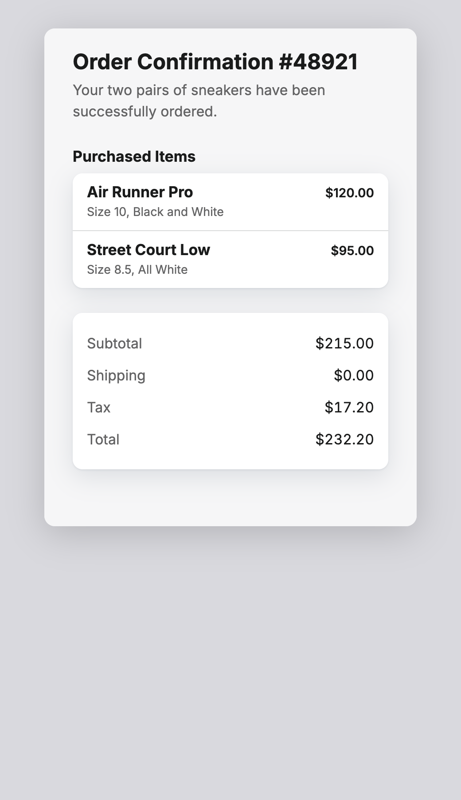

The total is not bold, and at this step the pictures were placeholders, for the reasons under "What resisted".

Writing it once found two places where the tool asked a writer for words the tree has no place for: a heading
for the list of a feed (and a component for it that nothing pointed at), and a search placeholder where there
is no search field. `partSchema` and `BUILDERS.list` no longer do either; three feeds and a dashboard were run
through the real pipeline to see it.

**Step 3: `else`.** The tool has two chains, and had them as control flow: `bakeCustom` (look on the app's
shelf, else bake, else close the slot) and `Pictures.find` (look in the library, else have one made, else leave
the frame). `screen.md` now says both, and says under `custom_use` and in `subjects.md` what each answer means to
whoever makes the thing (the baker's `USES`, a subject's `shot`). `fill()` in `fill.ts` tries a chain and knows
nothing else; what a source does stays the host's, and `bake.ts` and `pictures.ts` now have theirs by the names
the file uses. The slot's own plumbing (`use`, `data`, `selection`, `failed`) left the graph for the pattern:
a graph says what fills a part, not how a slot is wired. The tests hold that:

- the custom chain read from `screen.md`, tried by `fill()`, does what `bakeCustom` does, call for call and
  message for message, with the models stood in for, under eight scripts: nothing on the shelf; Jev takes what
  is there and only its data is written; Jev says none of these; what is there cannot be filled; the first bake
  refused and the second passing; both refused and the slot closing; made again at the developer's word; a
  shelf of the wrong kind. With its steps in another order, or without its terminal, it does not;
- an item's picture chain read from `screen.md` does what `Pictures.find` does, under five;
- every chain in `screen.md` and `email.md` names what the catalog has and ends in a terminal, and a chain that
  does not, a source nobody has, a `by` on a maker and a knob set to what it cannot be are each said.

Both were then run through the real pipeline, since `bake.ts` and `pictures.ts` changed shape: a pomodoro timer
baked and a list of dog walkers got its four portraits, valid.

And the email graph got what it lacked. Its `code` part, which nothing in the kit draws, became
`### code → slot with ratio 3:1`, `filled from shelf else baked else closed`, with two sentences after an arrow
for a contract; its pictures became `from library by pictures_of else painted else placeholder`. Drawn live:
the code baked in 7 s while the rest stood, to the letter of its arrow (large, in spaced groups, what it is for
above, how long it lasts below, a button to copy it); of six pictures for a hiking newsletter, three came from
the library and three were painted, the lead one among them.

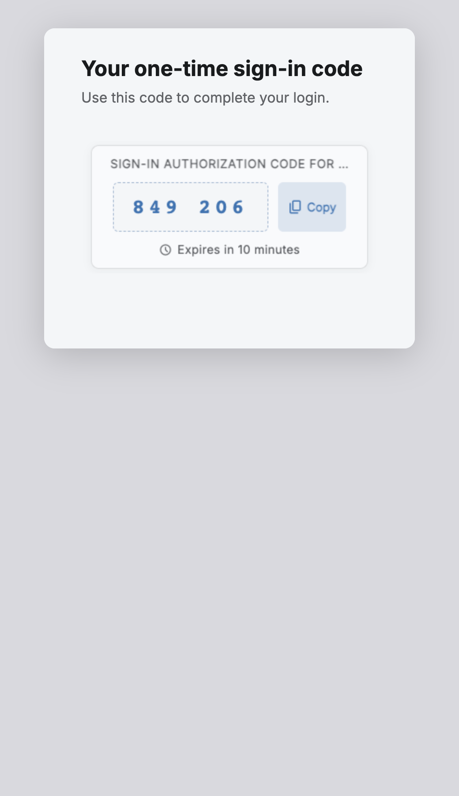 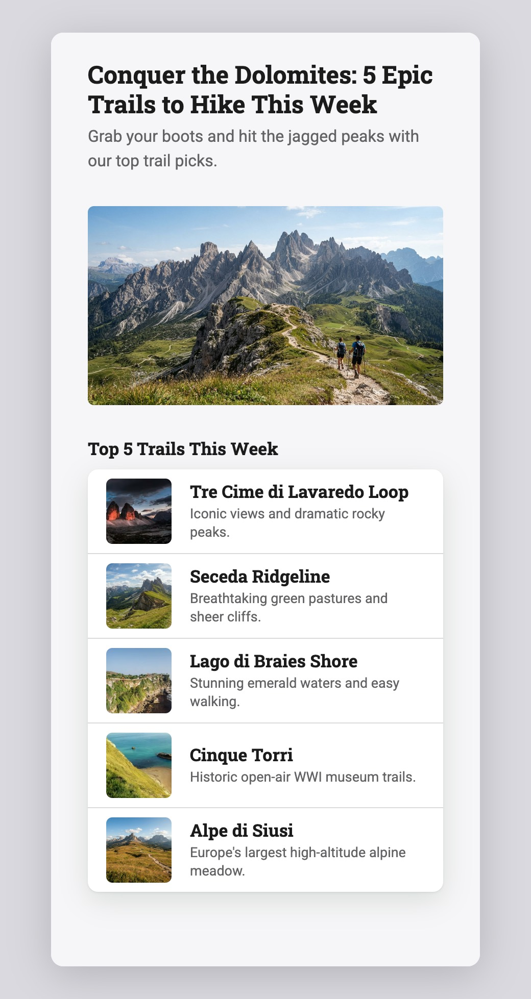

Two of the three from the library are wrong (a sea cliff for an alpine lake, a beach for a group of rock towers). The chain did
what it says; the mountain shelf and an offer of five is where that went wrong, and no file is going to fix it.

**Step 4: `decided`.** Six of the seven functions of `refine.ts` have the same shape (the seventh, the kind of
a form's field, is 26 below), and `screen.md` now has all of what they ask: ten questions under six parts (the rows of a group, the items of a list, the figures that moved,
a banner, the navigation, the buttons), five rules about elements, `all or none` once and `one where` once.
`decide()` in `decide.ts` is refine.ts done for any graph. The tests hold that:

- for 400 made-up groups and 300 each of the other five, **what Jev reads and what Jev is asked are deep-equal
  to what refine.ts sends**, and the same answers, given to both, leave the same data: with and without
  symbols, with and without an option the person is already known to have chosen, with figures that did and
  did not move, with one button and with two;
- a question is needed exactly when the pipeline works out by hand that it is (`want.tones`, `want.icons`,
  the design's `icons`, `statDeltas`): over 1500 random screens, "the tree the file makes reads the field"
  says the same;
- nothing said about a decision is decoration: without any one of the four rules about rows, or `all or none`,
  or `one where`, some group comes out differently;
- none of it is asked before there are words: the first request is still deep-equal to `planQuestions()`.

Writing it down found that `refineGroup` turned a group's symbols off from the first option-to-pick-among
*onwards*, so a group whose second row was one kept the first row's symbol. It decides before reading any row
now; two settings screens were run through the real pipeline to see it.

The email graph got two such questions by hand (whether its warning is bad news, which button is the main
one), and `probe:draw` asks them as each part is written. A failed payment, drawn live: the warning read as
`danger` at 0.91, and the only button made the main one without asking anything.

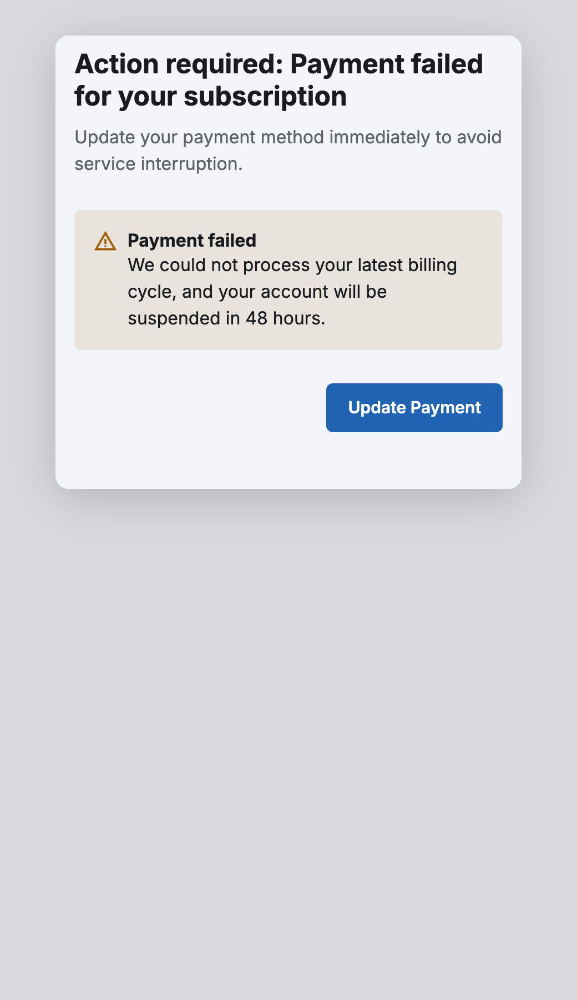

**Step 5: the tool reads the file.** `runMock` (`mock/pipeline.ts`) now asks `questionsOf(screen.md)`, reads
the answers with `readGrammar`, draws each part with `treeOf` and the kit's patterns, asks each writer for
`schemaOf` its part, fills what nobody writes through the file's chains, and asks what is decided once the
words exist with `decide()`. `plan.ts` kept the shape of a plan, what is taken of one a browser sent back, and
`applyDesign`; `screen.ts` kept the frame; `refine.ts` kept the form field; `BUILDERS`, `partSchema`,
`readPlan`, `planQuestions`, the question tables and six of `refine.ts`'s seven functions were deleted. What
code still knows by name is in `mock/graph.ts`: the kinds and their traits (for the frame, `change.ts` and
`talk.ts`), the options a browser may send back, and `readingOf(plan)`, the way from a plan back to a reading,
because the design and the developer's word are applied to a plan and the drawing reads a reading.

The safety: before the deletion, the readers were still held equal to the hand-written code (all 29 differential
tests, re-run under a better seeded generator, since the old one never produced a feed), and what they make of
600 recorded sets of answers (200 plans, 16 screens' trees and schemas, 40 screens' later decisions) was
written down (`fixtures/screen.json`, 730 KB). `regression.test.ts` holds the file and the readers to that
recording; a change to `screen.md` that is meant is recorded again with `RECORD=1`. The bundle carries
`grammar/` beside `main.js` (`build:server`), and the production smoke test starts it.

Live, after the switch: nine screens of every kind, the edit path (a recipe made again with a button
added, its prose, facts and steps kept word for word), and the tap-through path (a walker tapped from a feed:
a detail page about one person, with their portrait carried). All valid; trees at 180–330 ms; a checkout's
totals bold on the last line, its items toned, a "Delete account" button red, a timer baked in 13 s.

One mistake on the way, which cost something: the list's later question was hooked without the `once` the old
code had, and since a refinement re-sends the part, which calls the hook again, the tool asked Jev about the
same list every 60 ms for the ten minutes a test run sat on a checkout screen, and again for a minute while
it was found: roughly nine thousand Jev requests. Fixed with the `once`, and a comment says why it is there.

**Step 6: the frame as a pattern, with a swappable catalog as the north star.** `screen()` in `mock/screen.ts`
was the last hand-built piece of the tree: the app bar, the navigation bar, a profile's opening, an outcome's,
the dialog, the sticky bar, and the reading of the kind's traits that chose between them. It is now the `page`
pattern of `kit.md`, with five slots and eight knobs (above), and `frameOf()` in `make.ts` builds it from the
file the way `treeOf()` builds a part: knobs from the top-level answers, then the kinds' heading, then the kind's
traits; slots from the header and the navigation. Along the way:

- the navigation bar binds each destination's symbol (`NavBar.icon`, a relative binding the renderer now
  honours), so "is the symbol needed" is read off the frame's tree like any other field's, and the pipeline's
  last hand-set `plan.icons` is gone;
- a profile's portrait is a field of the header (`imageUrl as portrait, from library else painted else
  placeholder`) and joins it as a decoration, where it was written to `/person` by hand;
- "a profile has no lead photograph" is a rule in the file (`when person is yes, no hero`) instead of the frame
  quietly not placing a hero it had fetched;
- "a main screen's bar leads with nothing, whatever the kind says" stayed in the pattern, since it is the
  pattern's system's rule (Material's top-level destinations have no up arrow), and a kind's `leading close`
  must not beat it;
- `Kind` in `graph.ts` lost its three booleans; the frame reads the traits, not code.

The recording was compared before and after: every plan, tree, schema and decoration is what it was, but for
the three things meant (profiles lose their hero; a result shows the symbol Jev chose, which the old
recording's shortcut had hidden; navigation bars bind their symbols). Live: six screens whose frames differ
(a profile, a dialog, an outcome, a form, a main screen, a detail page), the edit path and the tap-through
path, all valid, trees at 160–330 ms, and a tapped walker's picture travelling into the header of the profile
it opens. The email graph then got the same frame with one line, `## kind → page with leading none, intro yes`,
and is drawn with a large title, its preheader as the line under it and no bar of destinations: the first thing
a brought graph draws that is not a bare page.

**Step 7: idioms, in two cuts.** An idiom is the three things an app is imagined with: the grammar that reads
the description, the catalog that draws what it says (a file, and the code behind it that draws each pattern), and
the stylesheet that paints it in the browser. The tool's own is `screen.md`, `kit.md` and `src/web/kit/kit.css`;
they are named in one table on each side (`src/shared/idioms.ts` for what both know, `src/server/idioms.ts` for the
files and the code, `src/web/kit/idioms.ts` for the sheets), and which one a request is imagined in is the request's
to say, in an `X-Idiom` header, carried the way the endpoint that answers System One is carried (`models.ts`). The
person chooses it in the bar, where it is a step of the path to the app, and calls it the grammar: a preset that
new apps are made in, changed about once a session and remembered between visits. An app keeps the idiom it was
made in for as long as it lives; choosing another while one is open starts a new app, and opening a saved app
made in another shows that one and leaves the preset be. It is saved with the app and restored with it
(`SAVED_APP.idiom`; an app saved before there was a choice is the kit's), and kept beside it for the library. It
was first a toggle in the design panel, over an app that had screens already; that rewarded a grammar that
survived the switch, which is to say one that copied the tool's (item 63), and it is gone (2026-09-23). The page is
painted in one idiom at a time, and every baked component's frame is handed the same sheets.

*The first cut proved the catalog half and not the grammar half.* It added iOS as a catalog over the same
`screen.md`: the kit's twelve patterns with a `page` of its own (`patterns-ios.ts`: a navigation bar that centres
its title, a large title under the bar on a main screen, a chevron and a word to go back, a tab bar, an alert that
leads with no symbol and stacks its buttons under a hairline) and a stylesheet layered over the kit's (`ios.css`)
that fixes what iOS fixes as the `--k-*` variables the kit already reads. That was worth having, and it was the
wrong half to stop at: the point of an idiom is a *different graph*, and a grammar that asked one question
`screen.md` does not ask could not have run in the tool, because of what the next paragraph removed.

*The second cut: the tool holds nothing but the reading.* Between a reading of the file and everything the tool did
with it stood `ScreenPlan`, a struct whose fields were the tool's own questions by name (`topLevel`,
`list.leading`, `factsTotal`, `custom.size`); the design and the developer's word were applied to it, the writers
and the baker read it, the browser held it and sent it back, and the drawing converted it back into a reading
(`readingOf`, item 33). A grammar with other questions had nowhere to put its answers. It is gone, and each thing
it stood for is read off the grammar by what its fields and questions say:

- when to look for a picture: *a field whose chain looks in a set is bound in the tree* (`looked`), not
  `leading === "thumbnail"`; people are pictured as portraits by a rule in the file (`when item_leading is avatar,
  item_subject is portrait`), not by a special case;
- what to bake and to what: *a part with a `filled` chain*, its contract read off the part (`customOf`: the answer
  whose options speak to a maker, the `ratio` knob, a field taken from another part's data), not `plan.custom`;
- which row of a bill is its total: the `details` pattern's computation of `strong`, gated by the field's `when`;
- what the design rules out: three `given` questions and five rules with their reasons, where `applyDesign` was;
- what stays of a screen made again: `Graph.keptOf`, every answer the browser sent back that is one the file could
  have given, under the parts that stay; the rules then have their say over it;
- whether this is a main screen: the frame's `navigation` knob; what is written: every content node in scope and
  every part with a schema; which writer waits for which: a part with a note that holds waits for the collection;
- the browser holds the reading (`{kind, blocks, values, p}`) and sends it back; the key the description is read
  under is the grammar's (`screen`, `email`).

The tests hold that: what the old plan would have been, made of the new reading through the old `planOf`, is what was
recorded, for 195 of 200 readings, the five others being the portrait rule; every recorded tree is what it was but
for one, a details part without a total whose `strong` is no longer bound; what is decided once the words exist is
byte for byte what it was. (`examples/email.md` was run as an idiom for a day, by header and probe. It is not one
now: the tool imagines apps, and an email is not an app. The file stays as a test of the format.)

Live, through the served app: a checkout whose bill adds up and ends bold; a profile with its portrait; a walker's
picture carried from the feed to the page it opens; a pomodoro timer baked; a feed generated again with a notice
added and its list kept word for word; a settings screen that writes no navigation and a feed that does; and, in
the Email idiom, a sign-in code baked into an email with a Copy button, a receipt whose totals wait for its lines,
a newsletter with its pictures, and a message about the email read over its reading and acted on.

The same description, twice:

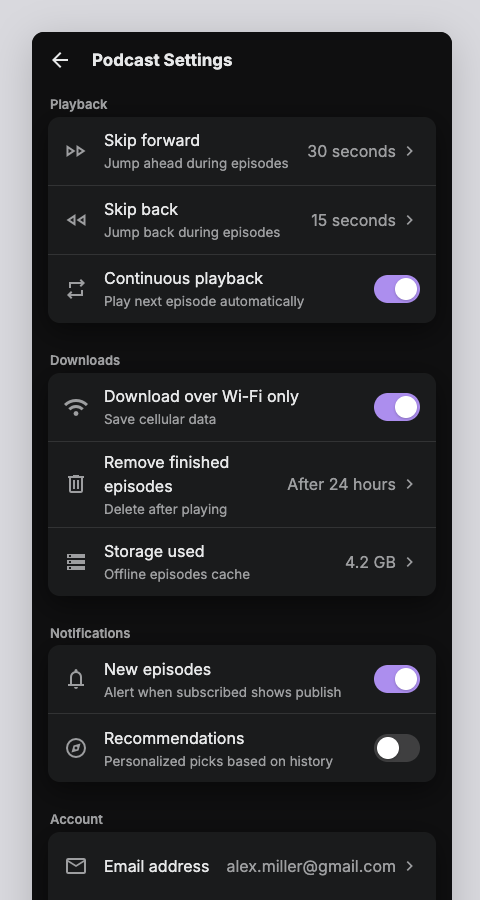 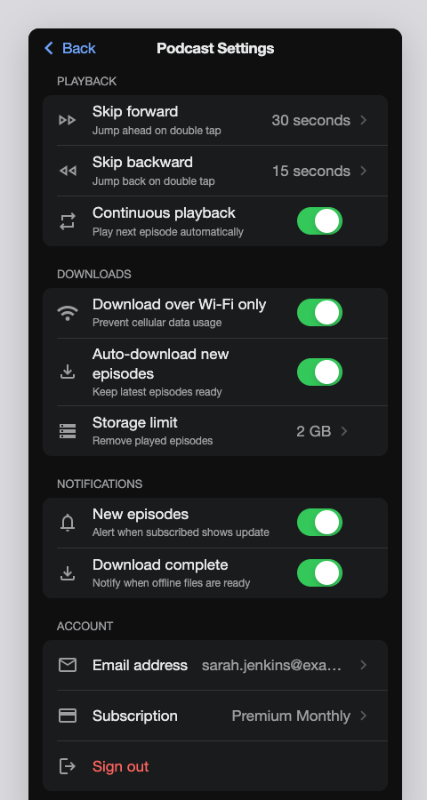 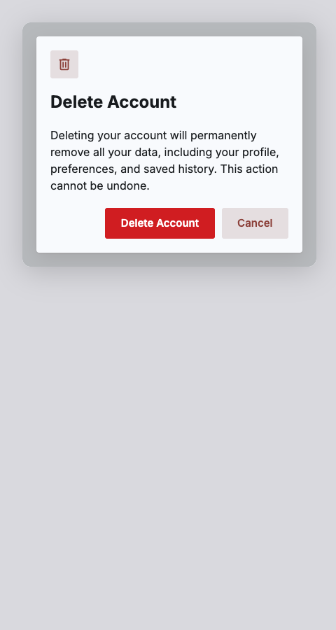 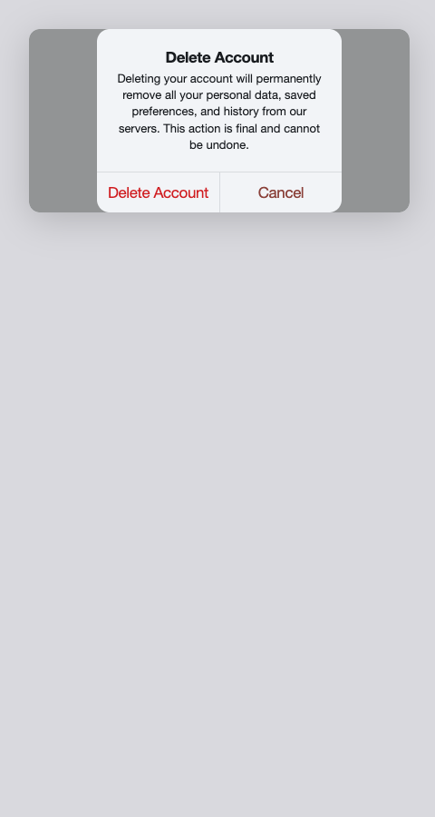

**Step 8: iOS as a graph of its own.** `grammar/ios/screen.md` is written from the Human Interface Guidelines and
not from `screen.md`. Its kinds are the ways iOS *presents* a screen, because that is what decides its frame: a
tab's root (`browse`), a screen pushed onto the one before it (`detail`, `settings`), a sheet with Cancel and Done
(`compose`), an alert (`alert`), an action sheet of choices from the bottom (`choices`), a full-screen cover for a
first run (`welcome`) or an outcome (`done`). It asks what `screen.md` never asks: whether the screen is a
self-contained task the person completes and dismisses (`sheet → presentation`), whether the collection is edited
from an Edit in its bar (`editable → trailing`), and search is a part expected on a tab's root, with the scopes
results split into. Its frame (`patterns-ios.ts`) has knobs of its own — `presentation`, `title large|inline`,
`leading back|cancel|close|none`, `trailing` — and the kit's two frame components grew to carry them: a word that
acts in the bar (`AppBar.trailing`, `leading: cancel`) and a presentation on the screen (`Screen.presentation`),
which the stylesheet paints as a sheet with a grabber, an action sheet with Cancel set apart, and an alert that
stacks three or more buttons. Twenty-four examples were labelled from the guidelines before the first run; after
two wording fixes and one shape fix, 24 of 24 come out as labelled, 66 claims of 66. Live, through the served app:
an inbox with a large title, compose and Edit in its bar, a scope bar and the tab bar; a tap pushes the message
with a chevron Back and a share symbol; a settings screen, an alert, a share sheet, an order confirmed.

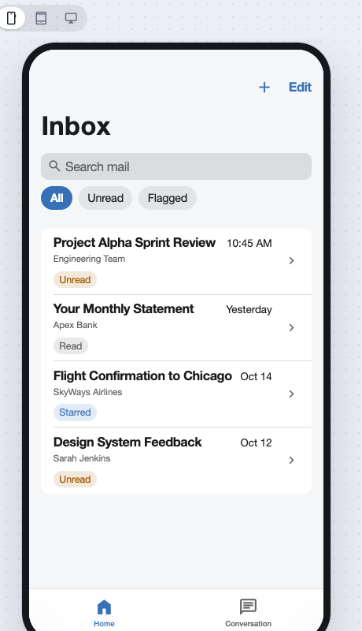 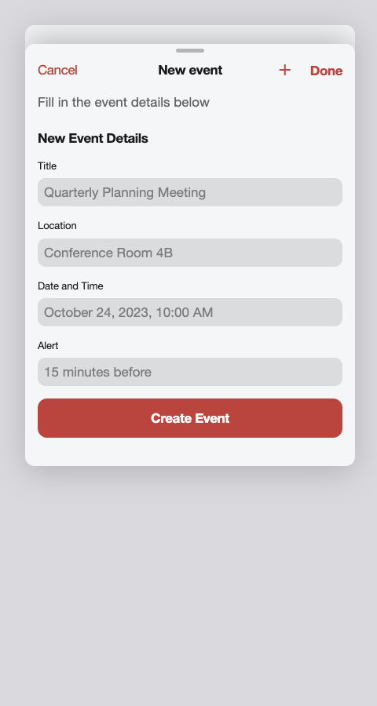 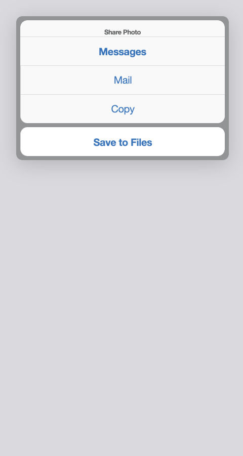 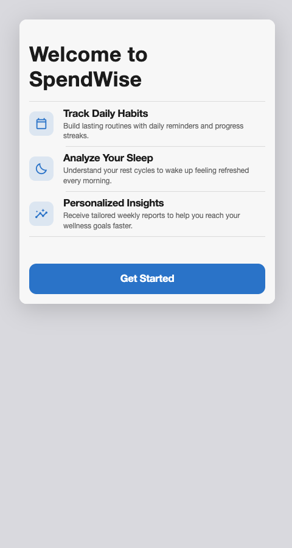

The question this answers, measured against the files: **are the two design systems the same graph?** Of iOS's 36
questions, 25 have the same id as one of `screen.md`'s 34, and 24 of those the same words: every question about
the *content* (is it several similar things, what leads each, has it a price, is a figure's change good news,
what is the picture of) and every later question. What differs is the kinds (8 against 9, none alike), the
questions that decide the frame (`sheet`, `editable`, `bar_action`, `tab_root` for `top_level`), three parts
(`search`, `features`, and `text`/`details`/`buttons` under their own names) and eleven more rules, all about
presentation. So: a shared trunk of content decisions, and a dialect that is the frame and the kinds — which is
what the first cut had guessed and could not show.

First-run misses worth keeping: `search` came out at 0.65–0.67 on an inbox and on search results, under the 0.75 an
extra needs, and the fix was the shape, not the words: on iOS search is *expected* on a tab's root. And a product
page lost its hero because `probe:grammar` gave no design and "no photographs" was the default (51): the givens are
now phrased as what a design rules out.

**Step 9: each idiom brings its own components** (#25). Until then there was one set of components, the kit's (`KIT`
in `src/shared/kit.ts`): the server checked every screen against it whatever catalog the screen said it spoke, and one
element drew it. An idiom whose components differ could only add to the kit's, and iOS had (a presentation on the
screen, a word at the end of the bar, Cancel leading it). That would have made the kit the union of every design
system, and a grammar written to differ in structure (#22, Windows) would have drawn with the same pieces as every
other. The renderer already fell into two halves, and the line now runs between them:

- what every set shares is said once (`src/shared/components.ts`: the value schemas, the baked component and its
  message, what a set is) and drawn once (`src/web/surface.ts`, `<ui-surface>`: the data model, bindings, a template
  stamped over nothing until its array arrives, taps, the slot a baked component runs in). Nothing in it names a
  component, a part or a path: a slot says where what fills it is (its `use`) and where what is picked in it goes
  (its `selection`), a group tells the rows in it which section they are in, and what a button's tap leaves behind
  (the pictures, the app's destinations) is the host's to strip;
- a catalog brings its set: the schemas and the props that name other components (`src/shared/sets.ts`, by catalog
  id), and a drawing, a function per component (`src/web/sets.ts`). The surface a screen is created with says which,
  so the server checks it and the browser draws it by the same id. The kit's are `kit.ts` and
  `web/kit/components.ts`; iOS's are the kit's with a screen and a bar of its own (`shared/ios.ts`, `web/kit/ios.ts`),
  and `kit.ts` has nothing of iOS's;
- the browser is told what the frame is by the server, from the frame pattern, in a `frame` event: whether it sits
  over the screen it was opened from (`Pattern.over`) and whether it is a main screen (the `navigation` knob, as
  before). It used to read the kit's `Screen.dialog` and `Screen.navBar`;
- what the surface draws itself (unwritten text, symbols, the slot) is painted by `src/web/surface.css`, which every
  idiom's sheets are layered over; the dim behind a dialog moved from the shell's sheet to the kit's, keyed on the
  surface being marked `over`.

The tests hold that every idiom's frames are trees its own set accepts, and that a catalog of three components the kit
does not have (`Window`, `Column`, `Line`) draws a grammar of its own, is checked against its own set, and is refused
under the kit's id (`components.test.ts`). Live: ten screens of both idioms, captured from the served app before the
change and drawn by the surface after it, came out the same HTML and the same pixels (a baked timer's frame differs
only in being handed `surface.css` first). The frame event agreed with the old reading of the root on ten fresh
screens. In the served app, in both idioms: a feed tapped through to a profile with its portrait carried, and back; a
settings row reporting its section; a confirmation over its screen, dimmed, closed by Cancel; a baked seat plan's picks
carried to the next screen through the slot's own `selection`. And the three made-up components were drawn by the
served app's own surface, shimmering before their words and reporting a tap.

**Step 10: Windows 11, by the method and not from the kit** (#22). `grammar/windows/screen.md` was written from
Microsoft's guidance for Windows apps, with the rule that a grammar sharing the other two's kinds, parts, question names,
patterns or components has failed. So the method was followed from the system's own words:

- *What decides the frame.* Microsoft names four app silhouettes: a navigation pane down the left (Settings), navigation
  across the top (Photos), a menu bar (Notepad), tabs (Terminal). A silhouette is the app's, not the page's, which neither
  other grammar had to say: the question has the trait `app`, is asked of an app's first screen, and every screen after it
  is given the answer (the browser carries it as `journey.settled` and saves it with the app).
- *The kinds* (`page_type`) are Microsoft's page patterns (landing, list/details, details, forms), Template Studio's
  content grid and data grid, the settings page, the content dialog, and the document a menu bar or tabs are for.
- *The questions* are Microsoft's "is this the right control" said as facts about content: five to ten sections or five
  or fewer; a path more than two levels deep (a BreadcrumbBar); a few views of the same things (a SelectorBar); told apart
  by words, by look, or by look in their own shapes (an ItemsView's stack, grid or flow); records compared in columns; items
  switched between often, read beside the list (list/details); several acted on at once; a command used only now and then
  (behind See more); the app's state, not the person's last act (an InfoBar).
- *The parts* are WinUI's controls, drawn by a catalog of 19 patterns of its own (`patterns-windows.ts`) with a set of 27
  components of its own (`shared/windows.ts`, `web/windows/`), painted by `windows.css` over nothing of the kit's: Mica and
  the layers above it, the type ramp, 4 and 8 px corners, strokes rather than shadows, and the pane that folds at 1008 and
  640 px. A content dialog's responses are three named slots in Microsoft's fixed order, so which one closes it is
  structure and is not asked. Settings apply at once, as cards, with About last, and the page selects Settings at the
  pane's foot.

Twenty-three examples were labelled from real Windows apps before the first run. The first run read 19 of 22 as labelled;
the three misses were extras kept at 0.73, 0.63 and 0.53 of the 0.75 an extra needs, and, as with iOS's search, two were
shapes and not words (a breadcrumb is expected on a data grid, a FlipView on a details page) and the third a question
turned from a change into a state (the InfoBar). Then 22 of 22, 68 claims of 68. One later question was worded backwards
and came back at even odds for every command (0.52–0.57, all behind See more) until its first clause was the yes.

Measured (`npm run probe:share`): of Windows's 9 kinds, 19 parts, 21 questions, 4 things always written, 19 patterns and
27 components, it shares with the kit two kinds (`settings`, `form`) and one component (`Button`), and with iOS one kind
(`settings`) and `Button`. Those are Microsoft's own names for a settings page, its forms page pattern and WinUI's Button;
nothing under them is shared. For comparison, iOS shares 31 of its 38 questions with the kit, and all of its patterns and
components.

The tool had to learn four things, each of which had been a name of the kit's:

- *what a frame's slots and knobs are for*, from the frame (`Pattern.roles`: which slot is the screen's title, which the
  app's destinations, which knob makes a main screen), where the pipeline wrote a node called `header` first, sent
  destinations to `/nav` and found a main screen by the knob `navigation`. The browser is told where a screen's title and
  destinations are in the `frame` event (54 is gone);
- *where the app's destinations go*: wherever the frame draws them, on every page for a pane, where it was only on a main
  screen, for a bar of tabs (58 half met: a grammar can say it now, by drawing them);
- *how many main destinations fit*: the grammar's list of them (2–5 tabs, 3–8 sections), where it was five everywhere;
- *on what device an app is shown first*: an idiom whose frame is a window says `device: "desktop"`.

Live, in the served app: a mail app in the left-pane silhouette, its list and the open message, a tap to another message
(a new page of the same kind with that one open), back, and Settings at the pane's foot; a text editor with its menu bar
and "ProjectNotes.txt – TextPad" in the title bar; a photo library with navigation across the top, a tap into a photo and
back; a file manager whose Delete opens a content dialog over it, closed by Cancel. The silhouette the first page read went
with every request after it. Kit and iOS were drawn again after the change, frames and headers as before.

## What resisted

What the export could not say, or could only say by growing the format:

1. **One rule form was needed after all**, and it is a guarded assignment. Eight of them carry everything
   `readPlan` does after thresholds. Precedence is not uniform in `readPlan` and the reader copies it as is:
   parts the developer settled beat rules, but rules beat a `topLevel` settled by how the person arrived.
2. **`never padding`.** A thin screen takes its likeliest remaining parts, but never a banner or a custom
   part. That is a trait of a part, and nothing in the first sketch had traits on parts.
3. **One threshold does not fit the tiers** (`has_custom`, probed at 0.55). It lives with the answerer,
   keyed by question.
4. **What an option yields is sometimes more than one value.** A ratio, an angle and a symbol fit in a code
   span. A typeface option yields four fields; an elevation yields a sentence for the DESIGN.md; a picture
   subject yields `shot`, the art direction the image model reads when a picture has to be made, which is a
   piece of a fallback. These are not in the files.
5. **A dial whose values depend on another answer** (`light` has one set of stops on a dark interface and
   another on a light one) has no values in `paint.md`, and `warmth` is read by a function, not a scale.
6. **`(circular)` is only a word.** `hue` says it, and the reader does not take the circular mean.
7. **"If…" is written by hand** into every question under a part. `plan.ts` composes it for item parts;
   the file has the composed sentence, and the lint warns when it is missing.
8. **Nesting is scope, and that made one thing explicit**: what the lead picture is of is read whether or
   not there is a lead picture (a tapped item's photograph travels to the page it opens), so it sits at the
   top of the file and not under `hero`.

From the catalog half:

9. **A gate needed `or`** (`item_trailing is switch or checkbox`), so an answer in a condition can be any of
   several. Across two questions there is still no `or`: `tone` colours a badge or a progress bar, and is simply
   always bound. What a pattern does with a slot it has no use for is the pattern's business, as it is when a
   grid is too tight for a second line.
10. **A yes had to turn a knob that takes a name** (`item_picture → leading`), so a yes and a no can yield.
11. **Ways a field gets a value that nobody writes.** Pictures and the custom part are chains (step 3) and
    `decided` is a question (step 4). `computed` (the last row of a bill is its total) was only a word until
    step 7, when it became the pattern's to work out (`Pattern.computed`, by slot); the receipt's total is bold
    now. `from /list/items` is another part's data, and is simply there.
12. **The frame is not in the catalog.** The app bar, the navigation, a profile's opening, a dialog, the sticky
    bar: `screen()` in `mock/screen.ts`. That is where a kind's traits, the header, `top_level`, `person` and
    `app_bar_action` land. `probe:draw` puts the parts on a bare page under the header.
13. **The look is a third input.** `contained`, `icons` and the placeholder symbol come from the design, not the
    graph, and a design can also overrule a reading (no photographs: no hero, thumbnails become icons). The
    first is a parameter of every pattern; the second is still `applyDesign`.
14. **Ids and paths.** Patterns call their pieces `<part>_…`; the builders say `item`, `stat`, `fact`. The
    renderer cares about one id (`form_submit`) but about several paths (`/list/items/3` is what a tap on an
    item reports), so a brought part called `items` draws but would not tap through.
15. **Which writer waits for which** (a bill for its lines) is guessed in `probe:draw` and said nowhere.
16. **A knob's values have no criteria.** The when-to-use of `cards` against `grid` is design-system knowledge,
    and belongs in the catalog for a graph's question to import, as options are imported from a set.
17. **Nothing in the kit draws a one-time code.** This was the hole an `else` is for, and step 3 filled it.

From the chains:

18. **What comes before a chain.** A subject read off the description may have been a guess (under 0.75), and
    then the words are read before the library is looked in. That is a policy for a torn answer, it is the
    host's, and the file cannot say it. `fresh`, too, is the runner's: made again, the sets are passed over.
19. **The baker speaks of screens.** Its brief says "it is a … screen" and what the kit draws around it, and a
    baked component's contract is typed as the screen graph's (`use`, `size`, `linked`). `probe:draw` hands it
    the email as a screen, with the contract said in words. A brought graph's contract should be its own.
20. *(Fixed in step 9: a slot says where what fills it is and where what is picked in it goes, by its own bindings.)*
    **One slot, called custom.** The renderer read `/custom/name` and wrote `/custom/selection`. The email's
    `code` draws, but a choice made in it would be written under another part's name.
21. **What a picture is of** is the words nearest its field: the item's first two, else the header. That is
    `itemWords` as a convention of `probe:draw`, said nowhere.
22. **A source's insides are prose.** The baker's prompt, its five checks and its two tries, the library's offer
    of five: the catalog says them in a sentence and in traits, and only `set`, `maker` and `terminal` are read
    by anything. `slow` and `joins shelf` are true and unenforced.
23. **The third chain is not on a field or a part.** When Jev finds nothing to do with a message, Gemini asks
    the person (`talk.ts`). That is an `else` on a turn, and turns are not in any file yet.
24. **`written` is a source too**, the first of every plain field, and its tier, its system prompt and which
    writer waits for which are still the host's.

From the frame:

38. **A knob's value "none" is a value.** The first draft of the pattern read `none` as unset, so an email that
    fixed `leading none` got a back arrow. Open knobs (`action`, `sticky`, `symbol`) still use `none` for
    "nothing"; closed ones (`leading`) take it as one of their names.
39. **Whose rule is it.** "A main screen's bar leads with nothing" could be a rule in the graph (`when top_level
    is yes, leading is none`) or the pattern's. It is the pattern's, because it is Material's, and a catalog
    that is Apple's may want a large title and no bar at all. Where a rule lives decides which file a style
    changes.
40. **The frame's knobs are the contract for a second catalog**, and they were named from one system's needs.
    A FAB (Material), a large title (HIG), a page header with a primary action (Polaris) each fit `action` and
    `opening` only loosely; the first other catalog will say which names were right.
41. **The renderer reads `destination`, `label` and `icon` of a navigation item by name**, and orders them
    (`orderedNavigation`). Only `icon` is bound now; the rest is still a convention between the pattern and the
    renderer.

From the idioms:

42. *(Half gone in step 9: an idiom brings its own set of components, with class names of its own if it likes. The kit
    and iOS still share the kit's.)* **One idiom's paint at a time.** Both idioms draw the kit's components under the kit's class names, so their
    stylesheets cannot both be on; the page is painted in the app's idiom, and a view that showed two idioms side
    by side would need the sheets scoped. The idiom is the app's, but the paint is the page's.
43. **The mix does not know what an idiom fixes.** Jev's mix has no system typeface, no 10 pt radius and no "no
    edges" among its options, and adding them would change what Jev is offered in every idiom. So the stylesheet
    fixes them by redeclaring the variables, which means the design panel shows a typeface the iOS screen is not
    set in, and a DESIGN.md that names one is overruled without a word. A DESIGN.md with holes, that an idiom fills
    and a mix fills the rest of, is the shape of the fix.
44. **An idiom's grammar had to keep `screen.md`'s ids** (fixed in step 7's second cut; an idiom's grammar can now
    ask anything, and `examples/email.md` runs in the tool). The iOS idiom still shares the grammar, and that is
    what #20 is now for.
45. *(Since step 9 the `/custom/*` paths are gone, and `form_submit` and a destination's names are the kit's drawing
    knowing the kit's patterns, within one catalog, not the renderer's.)* **Three names the frame contract does not cover** are still literal between a pattern and the renderer:
    `form_submit`, the `/custom/*` paths, and a destination's `destination`, `label`, `icon` (41). The iOS catalog
    honours them by reusing the kit's patterns, not by any check.
46. **Back carries no title.** An `AppBar`'s leading is an enum, and "Back" is a word the stylesheet writes; the
    title of the screen behind is the journey's, which the frame is not told.
47. **An alert's buttons come in the writer's order.** HIG puts cancel on the left and the confirming action on the
    right, and stacks three or more: rules about the count and the roles of a part's elements, which the pattern
    cannot read yet. The iOS alert draws the two side by side as written. (Which one is Cancel is now decided: 59.)
48. **The symbols are Material's in every idiom.** SF Symbols are not on the web, and a catalog's symbol set is not
    a thing the format says yet.
49. *(Gone, 2026-09-23: an app keeps its idiom, so nothing on the page switches under a baked component.)*
50. *(Gone, 2026-09-23: one field for the whole app is right, since every screen of an app is read by its idiom.)*

From the tool reading the file:

33. **A plan and a reading were two shapes of one thing** (fixed in step 7's second cut: the plan is gone and
    the tool holds the reading; the design and the edit are a rule and a `keptOf` over it). What the removal
    left behind is under "From the reading", below.
34. **The trace changed.** Decisions are labelled by the file's question text and ids (`item_leading`,
    `row_control_0`), where the hand-written code had short labels ("each item is…", a row's label). The trace
    panel and Gemini's answers to questions read them; whether either is worse for it is not measured.
35. **The navigation bar draws its own symbols** (fixed in step 6: it binds them, and the frame is a pattern).
36. **The four other files are still exported from code**: `paint.md` because `design-mix.ts` has not made the
    move (its dials are read by functions and one dial's stops depend on another answer, 5); `kit.md` because
    the catalog *is* code that draws; `icons.md` and `subjects.md` because they are lists of assets. And
    `screen.md` still links to `subjects.md` for what a picture can be of, which `photos/subjects.ts` owns.
37. **The regression fixture is blunt.** It says something changed and where, not whether the change is good; the
    file's own examples (`probe:grammar`) are the check that reads meaning, and they need Jev.

From what is decided once the words exist:

25. **Two things are about all the elements at once**, and needed words of their own: `all or none`, `one
    where`. Everything else in refine.ts was a question, a yield or a flat rule.
26. **The kind of a form's field is still `decided` by nothing the file says**, and the lint says so.
    `design.ts` is older than the kit: it asks about one field at a time, under other names (`user_request`,
    `form_field`), walks Jev's ranking to the first control the content can back (a choice needs options, a
    slider a lower bound under an upper one), and makes a choice of four or fewer into chips. That wants an
    option that is only on offer when something was written, and a count.
27. **Two conventions made the requests come out the same, and are said nowhere**: an element with one thing
    written for it is that thing where Jev reads it (a destination is its label, a group is its title), and
    `none` yields nothing.
28. **The names answers come back under differ.** refine.ts says `control_0`, `news_2`, `primary`; the file
    says `row_control_0`, `stat_news_2`, `main`, because a heading is an id and `icon` is asked in three parts.
    The requests were held equal in what is asked and in what order, not in these names. Whether Jev reads
    them is not known.
29. **What is already known is the host's**: the option the person saw on the row they tapped. `decide()` takes
    it as a function; the file cannot say where it comes from.
30. **The tool's own graph does not pass its own lint clean**: `row_on` and `destructive` do not say what yes
    and no look like. They were left as they are, since new wording is new behaviour and wants a probe first.
31. **When to ask** (as each group completes, once a list is complete) is the host's, with the streaming.
32. **Once in eight live runs of thirty, one plan differed from `readPlan`'s**, and it was not seen again, so what
    differed is not known; the probe now prints it. Both read the same answers, so it is a tie or a boundary and
    not chance. The one place they are built differently: `readPlan` reads most choices as Jev's `choice` but a
    symbol as the top of the ranking (`readIcon`), and the file's reader reads every choice one way. On a tie
    between two symbols those can differ. This is a suspicion, not a finding.

Not attempted, and each is a piece of the graph that is still only code:

- **Reading a change** (`change.ts`): every dial and gate has a relative twin ("what does this message want
  done to it"). That twin looks derivable from the graph rather than something to write down twice.
- **The design overruling the plan** (`applyDesign`) and **what stays when a screen is made again**
  (`keepPlan`). Both are layers over a reading: a DESIGN.md that says "no photographs" is a pin.
- **The app map** (`src/server/ia/`).
- **The reply when Jev found nothing to do** (`talk.ts`): the `else` of a turn.

From the reading:

51. **A given yes-or-no that nobody gives is no**, like any other. Phrased as what the design shows, the fourth
    runner (`probe:grammar`) forgot within the hour and lost a product page's hero; so they are phrased as what a
    design rules out (`no_photographs`), and silence rules nothing out.
52. **The size of a picture is a policy of the host**: a portrait is square and small, a thumbnail landscape and
    large where the `layout` knob is not `rows`. That is the catalog's knowledge (how big its `collection` draws a
    picture) and the pattern does not say it.
53. **Which writer waits for which** is now read, and from a thin signal: a part with a writer's note whose `when`
    holds waits for the part drawn as a `collection`, and is shown its elements. It is what a bill needs and the
    format still has no word for "must agree with".
54. *(Fixed in step 10: the frame says which of its slots is the title and which the destinations, `Pattern.roles`.)*
    **`header` and `nav` were names.** The header is written first because it is called that; the journey's
    destinations land at `/nav` because the frame's pattern reads them there; the IA sets the frame's navigation
    by finding the question that turns it. A grammar that called them otherwise would draw, and would not get
    the tool's navigation or its first screen.
55. **The IA speaks the tool's kinds.** `plannedSeed` maps `feed`, `detail`, `settings` and the custom part's
    uses to activities; another grammar's kinds fall to "Interact with the subject". The chat's words for a part
    fall back to the part's own question.
56. **The shelf's contract is still typed in the tool's words** (`use`, `size`, `linked`, in `BAKED`): a grammar
    whose contract question has other options is read to the nearest of them (item 19 stands). The renderer no longer
    reads `/custom/name` (step 9: the slot is wherever the part is).
57. *(Withdrawn, 2026-09-23: it was about the email idiom, which is gone.)*

From iOS as its own graph:

58. *(Half met in step 10: the destinations go wherever the frame draws them, so an iOS frame could draw the tab bar on a pushed screen; it does not yet.)*
    **The tab bar shows on a tab's root and not on what is pushed onto it.** iOS keeps the tab bar on pushed
    screens; the frame's `navigation` is turned by `tab_root`, and the tool sends the app's destinations only to
    screens whose frame says yes, so a pushed detail has no tab bar. Saying "in a tab" separately from "a tab's
    root" is a knob the frame does not have yet.
59. **Cancel is the last button because the writer is told so.** HIG's rules for an alert's and an action sheet's
    buttons (cancel last, the confirming one first, three or more stacked, destructive red) are a writer's note,
    a stylesheet `:has(> :nth-child(3))` and the `main`/`destructive` questions. Which button is Cancel is the
    graph's to say since 2026-09-23: `dismisses`, asked of each button once it is written, decides its `closes`,
    and the kit taps a button that closes as a back arrow, so the browser no longer guesses from English labels.
    Where that button goes is still the writer's (47 stands, half met).
60. **The frame's word is capitalised by the pattern.** `trailing done` yields `Done`; a grammar cannot say the
    word as the person reads it, only the knob's name.
61. **`ios_share` and `more_horiz` are Material's names for Apple's symbols.** The bar's action yields a symbol
    of the set every idiom shares (48 stands).
62. **A pushed screen's bar reads "Back", not the title behind it** (46 stands): the journey knows it, the frame
    is not told.
63. **The two grammars share their content questions by copying them.** Twenty-four questions are word for word
    the same in two files; a change to one is not a change to the other. A trunk two dialects import is what
    the copy is asking for.

From each idiom bringing its components:

64. **The tap is a protocol, and it is the kit's.** Its kinds (`item`, `row`, `nav`, `appbar`, `action`, `submit`,
    `back`, `part`), a `source` made of a data path, a `group`, a `variant`: the app map, `link.ts` and a saved app's
    links read them. Another set's components have to tap in these words to be followed; a command bar's command or a
    tree's node is one of them or the protocol grows.
65. **What the surface draws itself is in the kit's words**: unwritten text is a `k-skel`, a symbol a Material Symbol
    under `k-icon` (48 stands). `surface.css` paints them for every set; a set that wants them otherwise overrides it.
66. **A screen whose catalog has no drawing is drawn as the kit's**, as every screen was before there was a choice: the
    older pipelines' screens, in A2UI's basic catalog, still go through it and draw what the kit's drawing knows.
67. **The shell still reaches into the kit's classes once**: the room for a phone's status bar above an app bar
    (`.device.phone .k-appbar`). Which device an idiom is drawn on is #22's.

From Windows:

68. **An answer that is the app's and not the screen's** needed a trait (`app`) and the browser to carry it. It is given
    to every screen after the first; nothing checks that a later reading would have agreed.
69. **The app map's roles are generic** (Explore, Workspace, Status, History, Conversation, Preferences, Help), and a mail
    app got one section. A pane wants the app's own (Inbox, Drafts, Sent); the grammar's pane writer would write them, but
    the app map's destinations win.
70. **A page reached from a section selects nothing in the pane.** Windows keeps the section it was reached from
    selected; the frame is not told which (62 stands, for the same reason).
71. **The destinations arrive in the app map's shape**, so the pane's fields have to be called `items`, `label`, `icon`
    and `active` for its data to land; only their slots (`menu_items`, `content`, `selected`) are Windows's.
72. **The symbols are Material's** (48 stands) and the type is Segoe UI Variable only where it is installed.
73. **List/details is one screen.** The list and the open item are one writer's; opening another makes a new screen of
    the same kind with that one open, and the list is written again (#21 has the question of two screens on one page).
74. **The design gives Windows only its accent and light or dark.** The stylesheet fixes the rest (Mica, strokes, radii,
    type), so a DESIGN.md's greys and typefaces are overruled without a word (43, from the other side).
75. **The baker's four uses** (`watch`, `pick`, `adjust`, `read`) are the options of `canvas_use`, because the shelf's
    contract is typed in them (56 stands).
76. **The pipeline's keys** (`first_screen`, `reached_by`) are in the grammar's context, and the pipeline gives the
    design's facts only to grammars that ask `no_photographs` and its two siblings by name, so Windows is not told them.
77. **A command is tapped as the app bar's** (kind `appbar`), the protocol's nearest word (64 stands).
78. **Which of a dialog's responses is the default** is my reading of Microsoft's words (the one Enter takes, so the one
    safe to take by habit), and the grammar says so where it asks.
79. **Seen once and not again in three runs:** a first page whose words never showed, though the server sent them.

## Next, in the order that seems right

1. **An app grammar that is not a phone's**: Windows is step 10. A watch or a TV next, and the examples the tool offers
   should come from the grammar (55).
2. **A trunk two dialects import** (63): the content questions once, and `screen.md` and `ios/screen.md` each a
   kinds question, a frame and rules over it. The format has `among [set](file.md)` for options; it has nothing
   for questions.
3. **An idiom's own components** (the seam is step 9; no idiom has used it for a set that shares nothing yet): Material Web (`@material/web`, Lit, with a custom-elements manifest the catalog
   file could be generated from), where the renderer stops being one element.
4. **`paint.md` read by the tool** (36), and with it a DESIGN.md with holes for an idiom to fix (43).
5. **A contract of the graph's own** for the baker and the shelf (19, 56), and more than one slot (20).
6. **Form fields** (26), and **calibration from examples** with the policy for a torn answer (18).
